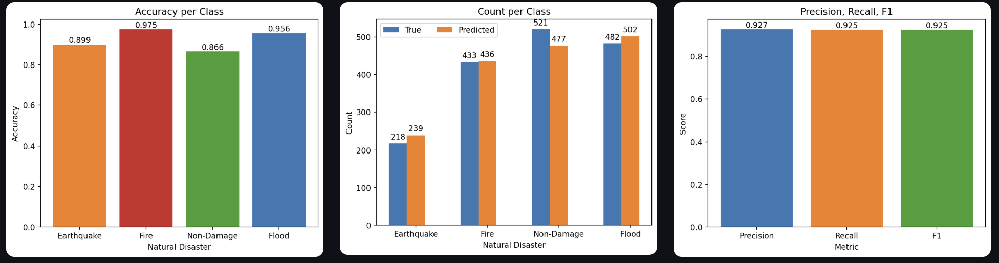

<h1 style="text-align: center"> Disaster Relief Image Classifier </h1>

<p style="text-align: center"> Transforming Disaster Response with Instant Image Insights </p>

<p style="text-align: center"> Built with these tools: </p>

        

## Table of Contents

1. [Overview](#overview)
2. [Prerequisites](#prerequisites)
3. [Dataset](#dataset)
4. [Model](#model)
5. [Streamlit-App](#streamlit-app)
6. [Docker-Deployment](#docker-deployment)
7. [Results](#results)
8. [Possible-Improvements](#possible-improvements)

## Overview

Disaster Relief Image Classifier is a comprehensive machine learning tool designed to automate the categorization of natural disaster images, streamlining emergency response efforts. The core features include:
- 💼 **Dockerized Environment**: Ensures consistent deployment across different systems, simplifying scaling and setup.
- 🌐 **Interactive Web Interface**: Built with Streamlit, allowing users to upload images, visualize results, and explore model performance effortlessly.
- 🧠 **Robust Model Training**: Utilizes a ResNet-50 architecture for accurate multi-class disaster classification with custom dataset handling.
- 📊 **Performance Evaluation**: Provides detailed metrics, confusion matrices, and ROC curves to assess and improve model effectiveness.
- ⚙️ **End-to-End Workflow**: Supports data preprocessing, model training, evaluation, and deployment within a unified structure.

To clone this project, run:

```bash
git clone https://github.com/DanielCruz09/disaster_relief_image_classifier
```

## Prerequisites

To install all dependencies, run the following:

```bash
pip install -r requirements.txt
```

## Dataset

This model was trained using AIDERv2 (Aerial Image Dataset for Emergency Response Applications), published by Shianios and Kyrkou (2023). Image transformations were applied to this dataset. To access the transformed images, you can download them from [HuggingFace](https://huggingface.co/datasets/DanielCruz09/natural_disasters) or directly from [Google Drive](https://drive.google.com/drive/folders/1qK_wc3gGGCVTgKriZrvV_IX5BBRcbJml?usp=sharing).

Any dataset can be used in replacement, but it must have the following structure:

```
├── data
│   ├── raw
│   │   ├── Train
│   │   │   ├── Earthquake
│   │   │   ├── Fire
│   │   │   ├── Flood
│   │   │   ├── Normal   
│   │   ├── Test
│   │   │   ├── Earthquake
│   │   │   ├── Fire
│   │   │   ├── Flood
│   │   │   ├── Normal 
│   │   ├── Val
│   │   │   ├── Earthquake
│   │   │   ├── Fire
│   │   │   ├── Flood
│   │   │   ├── Normal 
│   ├── processed
│   │   ├── Train
│   │   │   ├── Land_Disaster
│   │   │   ├── Fire_Disaster
│   │   │   ├── Water_Disaster
│   │   │   ├── Non_Damage 
│   │   ├── Test
│   │   │   ├── Land_Disaster
│   │   │   ├── Fire_Disaster
│   │   │   ├── Water_Disaster
│   │   │   ├── Non_Damage 
│   │   ├── Val
│   │   │   ├── Land_Disaster
│   │   │   ├── Fire_Disaster
│   │   │   ├── Water_Disaster
│   │   │   ├── Non_Damage
```

## Model

This classifier is built on:
- ResNet-50 pretrained on ImageNet
- A custom fully-connected layer for multiclass categorization
- Label smoothing during training
- SGD optimizer with momentum

The model is defined in `models/resnet50.py`. A full description of the model can be found on [HuggingFace](https://huggingface.co/DanielCruz09/disaster-image-classifier).


## Streamlit App

The Streamlit application can be found in `streamlit_app`. The application has features, such as:
- Uploading an image
- View predicted class
- Explore model performance

## Docker Deployment

Move to the repository directory:

```bash
cd disaster_relief_image_classifier
```

Build the container:

```bash
docker build -t disaster_classifer .
```

Run the container:

```bash
docker run -p 9000:9000 \
-v ${pwd}/data:/app/data \
-v ${pwd}/results:/app/results \
-v ${pwd}/models:/app/models disaster_classifier
```

This will load the Streamlit application and can be accessed at `http://localhost:9000`.


## Results

The classifier achieves:
- High accuracy across all classes
- Strong ROC curves
- Clear separation between disaster types




## Possible Improvements

Some potential improvements to this project include:
- Multi-label classification (some natural disasters can occur simultaneously)
- Improve class balance
- Add more categories (e.g., landslides)
- Include image metadata (e.g., geographic location)
- Decrease model overconfidence